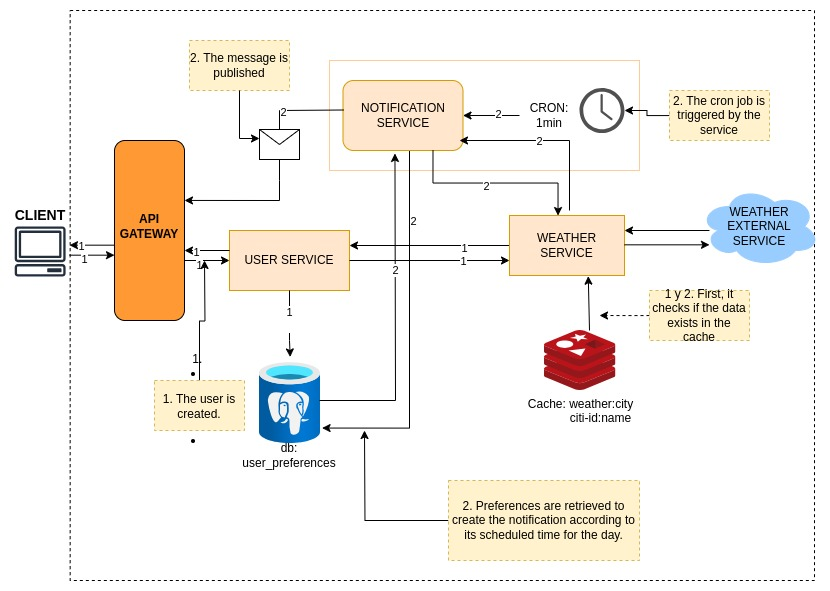

# Distributed Weather Notification Microservices with Caching and Messaging Queue Integration

[](https://pkg.go.dev/gocv.io/x/gocv)


## Summary

This project consists of a microservices architecture designed to send weather forecasts and wave conditions notifications to users. The solution is designed with a scalable and resilient structure, allowing for easy expansion to integrate other types of notifications in the future, such as SMS or emails.

## Diagram



## Description
The system is composed of: a user API that allows storing user data based on the client's request. Additionally, at the time of registration, it returns the weather information for the user's location for the first time. The API also enables scheduling daily notifications that will be received through a message queue and unsubscribing from notification scheduling.

The weather API incorporates cache handling to reduce the load on the external API and avoid duplicate requests, thus optimizing response time and resource usage.

Finally, there is a notification service that runs a cron job every minute. This service checks the user preferences table for scheduled notifications. If it finds any, it retrieves the current weather information and publishes the notification to the message queue channel.

I saw the need to separate the system into microservices so that each one can be scalable with the possibility of adding other services (as mentioned in the requirements).


## Run the project

```bash
docker-compose up --build
```

## Tests

### Register a new user

The location code and daily notification time are loaded into the user preferences table.

```bash
### Register a new user 
POST http://localhost:8082/register
Content-Type: application/json

{
    "location_code": "sao pablo",
    "notification_schedule": 23200
}

### ### Register a new litoral user 
POST http://localhost:8082/register
Content-Type: application/json

{
    "location_code": "florianopolis",
    "notification_schedule": 23260
}
```

- [ES Version](README_ES.md)


