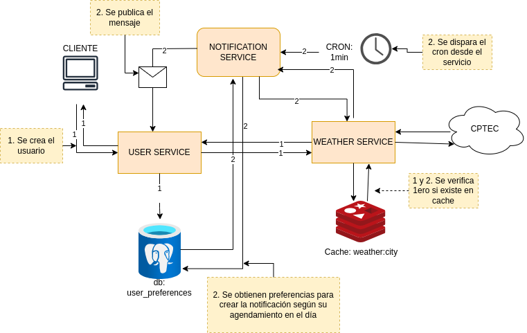

# Distributed Weather Notification Microservices with Caching and Messaging Queue Integration


## Resumen

Este proyecto consiste en una arquitectura de microservicios diseñada para enviar notificaciones de previsión meteorológica y condiciones de olas a los usuarios. La solución ha sido diseñada con una estructura escalable y resiliente, permitiendo una fácil expansión para integrar otros tipos de notificaciones en el futuro, como SMS o correos electrónicos.

## Descripción
El sistema se compone de: una API de usuarios que permite guardar los datos del usuario basándose en la solicitud del cliente. Además, al momento del registro, devuelve la información meteorológica de la ubicación del usuario por primera vez. La API también permite programar notificaciones diarias que se recibiran a través de una cola de mensajes y dar de baja la programación de notificaciones.

La API de clima incorpora un manejo de caché para reducir la carga en la API externa y evitar solicitudes duplicadas, optimizando así el tiempo de respuesta y el uso de recursos.

Finalmente, tenemos un servicio de notificaciones que ejecuta un cron cada minuto. Este servicio verifica en la tabla de preferencias de usuario si hay notificaciones programadas. Si encuentra alguna, obtiene la información meteorológica actual y publica la notificación en el canal de la cola de mensajes.

Ví la necesidad de separar el sistema en microservicios para que cada uno de ellos pueda ser escalable con posibilidad de agregar otros servicios (como los mencionados en la consigna).

## Diagrama



## Correr el proyecto

```bash
docker-compose up --build
```

## Pruebas

### Registrar un nuevo usuario
Se carga el codigo de locacion y el tiempo de notificación diarias en la tabla de preferencias de usuario.

```bash
### Registrar un nuevo usuario 
POST http://localhost:8082/register
Content-Type: application/json

{
    "location_code": "sao pablo",
    "notification_schedule": 23200
}

### Registrar un nuevo usuario litoral
POST http://localhost:8082/register
Content-Type: application/json

{
    "location_code": "florianopolis",
    "notification_schedule": 23260
}
```


